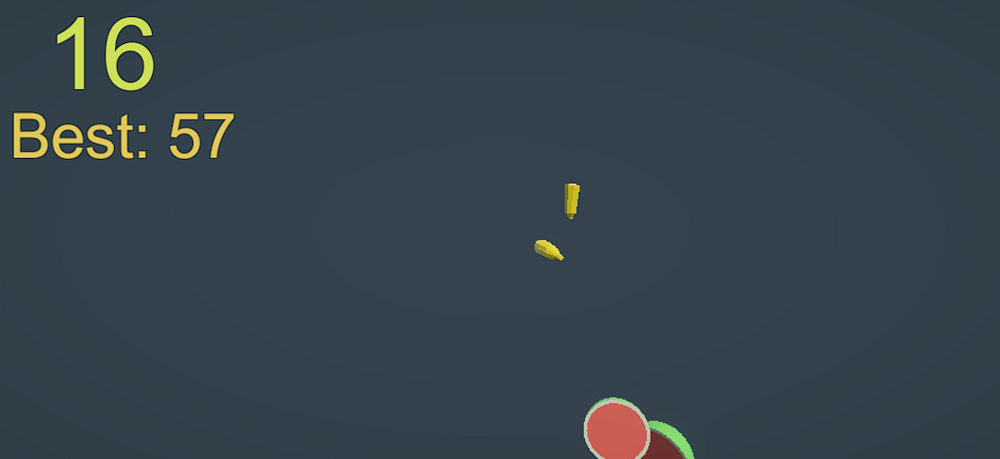
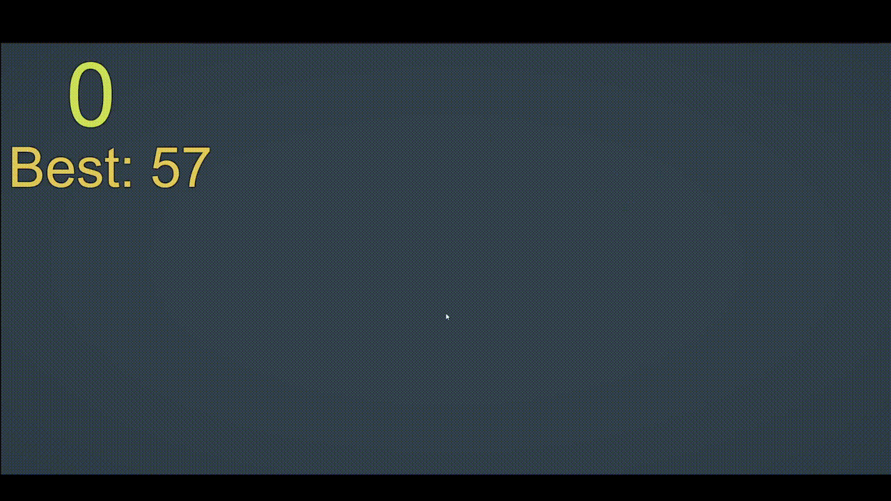
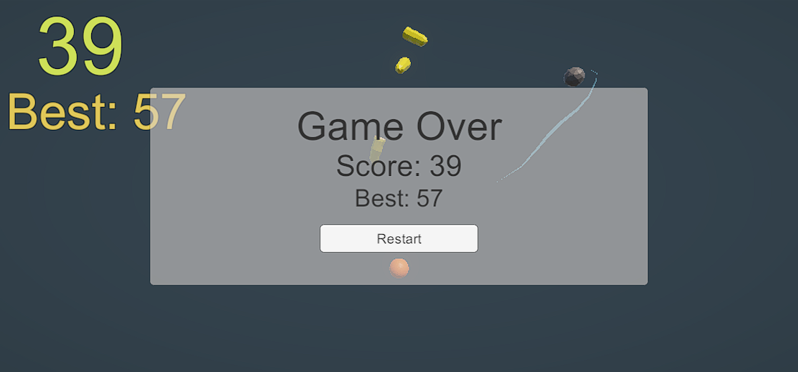

# 🍉 Fruit Ninja Clone

**Fruit Ninja** game clone built in **Unity** as part of my C# Masterclass learning journey.  
The goal is to slice as many fruits as possible while avoiding bombs.  
This project was built to improve visuals, input control, and gameplay flow.

---

## 🎮 Gameplay Overview

- Fruits are launched into the air with random speed and direction.  
- Swipe across the screen (or drag the mouse) to slice fruits mid-air.  
- Each slice earns points — but hitting a bomb ends the game!  

---

## 🧠 Learning Focus

- Implemented 2D physics-based motion
- Used prefab instantiation for random fruit and bomb spawning  
- Applied collision detection with trail slicing effect  
- Handled mouse/touch input for gesture-like controls  
- Managed score tracking and game over logic
- Added particle effects and audio feedback for slicing (not yet)
- Designed UI transitions (game over screen)  

---

## 🕹 Controls

| Action | Key | Platform |
|:--|:--|
| Mouse | Drag to slice fruits | PC |
| Touchscreen | Swipe with your finger to slice fruits | Android |

---

## 📸 Screenshots

---

## ⚙️ Technical Details

- **Engine:** Unity
- **Language:** C#
- **Platform:** PC (Windows/macOS/Linux)
- **Build Target:** 2D/3D

---

## 🧾 License

This project is part of my **C# Complete Masterclass** learning repository.  
You’re free to explore, learn, and reuse for educational purposes.  

